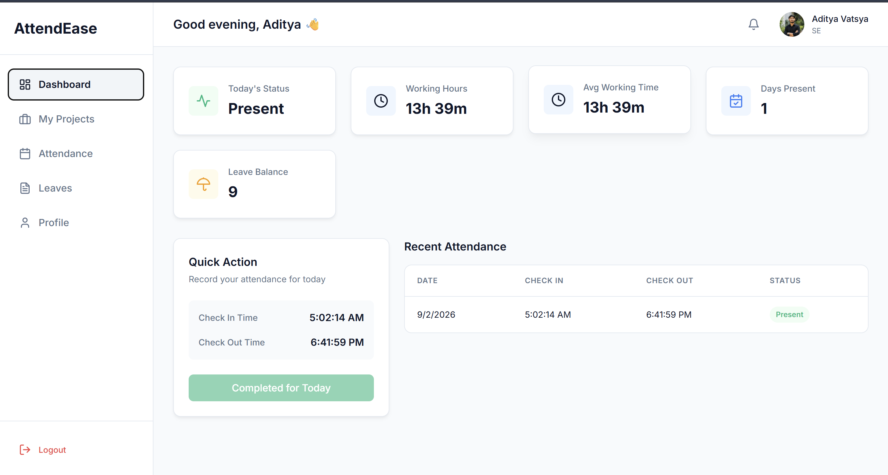
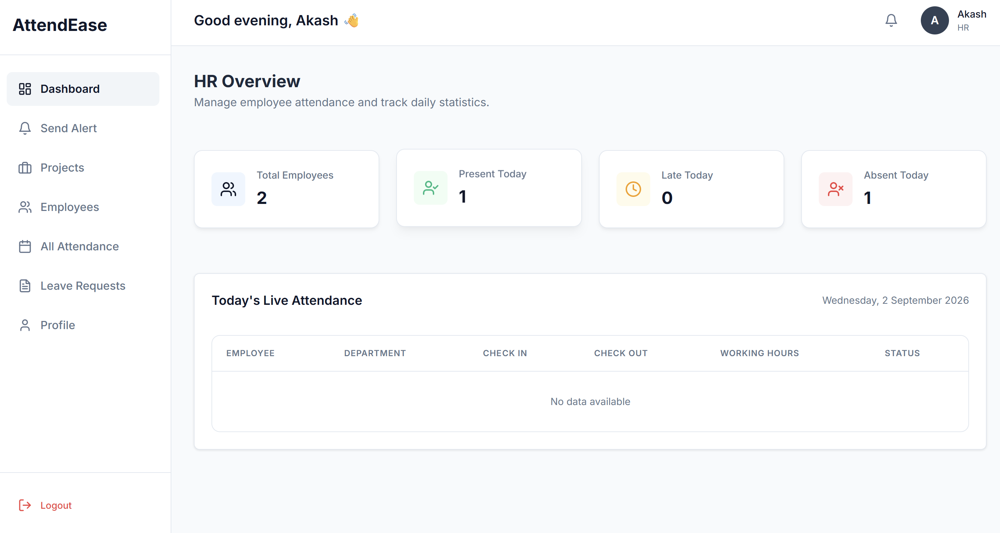

# AttendEase — Employee Attendance Management System

A full-stack MERN application for managing employee attendance, leave requests, and HR operations.





---

## Features

### Employee
- **Dashboard** — View today's status, live working hours, and recent records
- **Projects** — View assigned projects, update task status and completion progress
- **Attendance** — Geofenced check-in/check-out with automatic status detection and 10:00-10:30 AM enforcement
- **Leave Management** — Apply for leave, view balance, and track history
- **Profile** — Upload custom Base64 avatars, update name, and change passwords with strong security validation
- **Notifications** — Receive real-time alerts when leaves are processed or projects are assigned

### HR
- **Dashboard** — Overview of total verified employees, live attendance tracking, and attendance counts
- **Project Management** — Assign projects/tasks to employees and monitor live progress sliders
- **Notifications & Announcements** — Broadcast announcements to all employees or send direct personal messages
- **Employee Management** — Search and view verified employees
- **Attendance Management** — View all employee attendance records with calculated working hours
- **Leave Management** — Approve or reject pending leave requests

---

## Tech Stack

| Layer      | Technology             |
|------------|------------------------|
| Frontend   | React, React Router, Axios, Lucide Icons |
| Backend    | Express.js, Node.js    |
| Database   | MongoDB, Mongoose      |
| Auth       | JWT, bcrypt, Nodemailer (OTP) |
| Styling    | Vanilla CSS (Modern Minimalist) |

---

## Getting Started

### Prerequisites

- **Node.js** v16+ 
- **MongoDB** local or Atlas connection string
- **Email Account** (Gmail App Password for sending OTPs)

### Installation

1. **Clone the repository**
   ```bash
   git clone <repo-url>
   cd employee-attendance
   ```

2. **Install server dependencies**
   ```bash
   cd server
   npm install
   ```

3. **Install client dependencies**
   ```bash
   cd ../client
   npm install
   ```

4. **Configure environment variables**
   Create a `.env` file in the root directory or inside `server` based on your setup. A template is provided in `.env.example`.

   **Example `.env`**:
   ```env
   # Server settings
   PORT=5000
   MONGO_URI=mongodb://localhost:27017/employee-attendance
   JWT_SECRET=your_super_secret_jwt_key_here

   # OTP Email Settings (Required for Registration)
   SMTP_USER=your_email@gmail.com
   SMTP_PASS=your_app_password

   # Geofencing (Optional/Defaults to 100m from these coords)
   OFFICE_LAT=40.7128
   OFFICE_LNG=-74.0060
   OFFICE_RADIUS_METERS=100
   ```
   *For the React Client, if separating the repo, create `client/.env`:*
   ```env
   REACT_APP_API_URL=http://localhost:5000/api
   ```

### Running the Application

1. **Start the backend** (from `server/`):
   ```bash
   npm run dev
   ```
   Server runs on `http://localhost:5000`

2. **Start the frontend** (from `client/`):
   ```bash
   npm start
   ```
   Client runs on `http://localhost:3000`

---

## Business Logic Highlights

- **OTP Verification**: New accounts are invisible to HR and the system until a valid 6-digit email OTP is verified.
- **Geofencing**: Employees can only check in if their browser's location is within `OFFICE_RADIUS_METERS` of the designated `OFFICE_LAT` and `OFFICE_LNG`.
- **Check-in Window**: Check-in is strictly enforced between 10:00 AM and 10:30 AM.
- **Auto Check-out**: A background daemon automatically checks out any active sessions at exactly 7:00 PM and calculates total hours.
- **Leave logic**: Leave balance is only deducted upon HR approval.

---

## License

MIT
